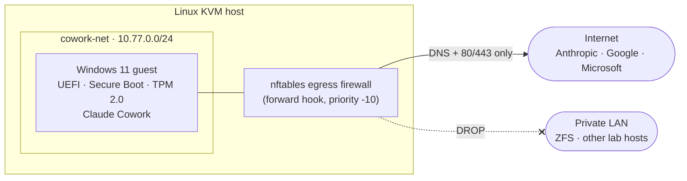

# Isolated Win11 VM for Claude Cowork

A build spec for standing up a **segmented, disposable Windows 11 guest** on a Linux libvirt/KVM host — purpose-built to run [Claude Cowork](https://support.claude.com/en/articles/13345190-get-started-with-claude-cowork) under revocable, MFA-gated sessions, with no lateral path to the rest of your network.

The premise: give an agent a place to work where the **only** asset is a set of connector sessions you can revoke in seconds — not your LAN, not your data, not your keys.

> **Note:** This repo is a runbook, not software. There's nothing to `npm install`. The single deliverable is [`win11-cowork-vm-buildspec.md`](./win11-cowork-vm-buildspec.md), meant to be executed step by step on a KVM host.

## Design principles

1. **The VM is a thin client, not a vault.** No personal data, no imported browser profiles, no SSH keys to other hosts. Everything of value stays unreachable from it.
2. **No lateral movement.** The guest cannot reach RFC1918 LAN hosts — only the internet endpoints it needs. This is the load-bearing control.
3. **The capability gate stays in software.** Network isolation caps crude paths; it does not harden the agent's judgment. Unattended/scheduled runs produce **drafts and proposals only** — never irreversible actions without a human present.
4. **Least privilege on connectors.** Log into only what's needed, minimum scopes, MFA everywhere.
5. **Disposable.** Snapshot after a clean auth, so re-auth or corruption is a rollback, not a rebuild.

## Architecture



The guest lives on a dedicated NAT network (`virbr-cowork`). A host-level nftables rule **drops** any traffic from the guest subnet toward `10.0.0.0/8`, `172.16.0.0/12`, `192.168.0.0/16`, and `169.254.0.0/16`, allowing only DNS and outbound 80/443. Even a fully compromised guest has no route to the rest of the network.

## What's involved

| Stage | Who | Summary |
|-------|-----|---------|
| Host prep | host | Verify virtualization, install QEMU/libvirt/OVMF/swtpm/nftables |
| Network segmentation | host | Define `cowork-net`, load the egress firewall **before** the VM exists |
| Create the VM | host | `virt-install` with UEFI + Secure Boot + emulated TPM 2.0 |
| Windows install | operator | Interactive OOBE, local account, minimal footprint |
| 24/7 config | operator | No sleep, autologon, launch Cowork in the interactive console session |
| Connector logins | operator | Least privilege, MFA, clean browser profile — no imports |
| Verify & snapshot | both | Confirm LAN is unreachable, then snapshot the clean authed state |

Egress is locked down by **observe-then-tighten**: run permissive with DNS/SNI logging, build a real allowlist from observed traffic, shadow-enforce, then hard-enforce — so a connector never breaks mid-run from a guessed-wrong rule.

## Requirements

- A Linux host with hardware virtualization (VT-x/AMD-V) and KVM
- libvirt/QEMU stack: `qemu-system-x86 libvirt virtinst virt-viewer ovmf swtpm nftables`
- ~100 GB disk and ~16 GB RAM to allocate to the guest
- Official Windows 11 and [virtio-win](https://fedorapeople.org/groups/virt/virtio-win/direct-downloads/stable-virtio/) ISOs
- A Claude account with Cowork preview access

## Scripts

Idempotent bash collateral automates the **Linux host** side of the buildspec
(the Windows install and connector logins stay manual). Tunables live in
`config.env`.

```bash
sudo ./install.sh     # fresh build: preflight → network → firewall → observe → create VM → verify
# ... do the manual Windows + Cowork + connector steps ...
sudo ./scripts/90-snapshot.sh   # snapshot the clean authed state + export XML for ZFS

sudo ./recover.sh     # after a server death: rebuild host scaffolding, re-import XML,
                      # reattach the ZFS-restored qcow2, verify
```

Recovery assumes ZFS has already restored the qcow2 to `DISK_PATH` and the
exported XML to `ZFS_EXPORT_DIR`. Dev: `make lint` (shellcheck), `make test` (bats).

**Reaching the console from a workstation** (no new services or firewall rules —
it reuses the SSH access you already have to the host; SPICE tunnels inside it):

```bash
virt-viewer --connect qemu+ssh://${HOST_ADDR}/system win11-cowork
```

**Console client (security):** run distro-packaged `virt-viewer` on a Linux
machine (current, CVE-patched spice-gtk/GTK/GStreamer). Avoid the Windows MSI
(11.0, 2021) — its bundled parsing stack is frozen and carries years of
unpatched memory-safety CVEs. SPICE stays bound to the host's loopback and is
reached only through the SSH tunnel.

The guest lives on a host-internal NAT network; it is never visible on the LAN.

Egress visibility is always-on: dnsmasq query logging plus a persistent
`cowork-sni.service` TLS-SNI capture, both rotated over a rolling ~14-day
window (`LOG_RETAIN_DAYS`).

## Disclaimer

Provided as-is, for an isolated single-host lab setup. Firmware paths and `virt-install` flag dialects vary by distro — verify on your actual host rather than copying literally. Network isolation reduces risk; it does not replace good judgment about what an agent is allowed to do.
