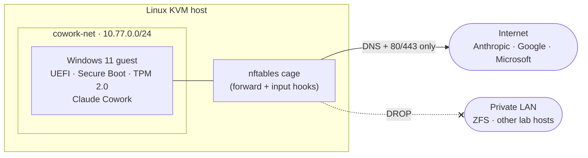

# Isolated Win11 VM for Claude Cowork

A build spec for standing up a **segmented, disposable Windows 11 guest** on a Linux libvirt/KVM host — purpose-built to run [Claude Cowork](https://support.claude.com/en/articles/13345190-get-started-with-claude-cowork) under revocable, MFA-gated sessions, with no lateral path to the rest of your network.

The premise: give an agent a place to work where the **only** asset is a set of connector sessions you can revoke in seconds — not your LAN, not your data, not your keys.

> **Note:** Two things that fit together — the human-facing runbook [`win11-cowork-vm-buildspec.md`](./win11-cowork-vm-buildspec.md), and **tested bash collateral** that automates the Linux-host side so a rebuild is a rollback, not a re-derivation (`make lint` / `make test`). The Windows install, Cowork install, and connector logins stay **manual**.

## Design principles

1. **The VM is a thin client, not a vault.** No personal data, no imported browser profiles, no SSH keys to other hosts. Everything of value stays unreachable from it.
2. **No lateral movement.** The guest cannot reach RFC1918 LAN hosts — only the internet endpoints it needs. This is the load-bearing control.
3. **The capability gate stays in software.** Network isolation caps crude paths; it does not harden the agent's judgment. Unattended/scheduled runs produce **drafts and proposals only** — never irreversible actions without a human present.
4. **Least privilege on connectors.** Log into only what's needed, minimum scopes, MFA everywhere.
5. **Disposable.** Snapshot after a clean auth, so re-auth or corruption is a rollback, not a rebuild.

## Architecture



The guest lives on a dedicated NAT network (`virbr-cowork`). A host-level nftables table drops guest traffic on two hooks: a **forward** chain blocks lateral movement to the LAN (`10.0.0.0/8`, `172.16.0.0/12`, `192.168.0.0/16`, `169.254.0.0/16`), and an **input** chain blocks the guest from reaching the *host itself* (SSH, shares, Webmin…) — everything but the host's DNS/DHCP. Only DNS + outbound 80/443 egress is allowed, and **all guest IPv6 is dropped** (the guest is IPv4-only, so v6 can't sneak past the family-agnostic accepts). Even a fully compromised guest has no route to the rest of the network.

## What's involved

| Stage | Who | Summary |
|-------|-----|---------|
| Host prep | host | Verify virtualization, install QEMU/libvirt/OVMF/swtpm/nftables |
| Network segmentation | host | Define `cowork-net`, load the egress firewall **before** the VM exists |
| Create the VM | host | `virt-install` with UEFI + Secure Boot + emulated TPM 2.0 |
| Windows install | operator | Interactive OOBE, local account, minimal footprint |
| 24/7 config | operator | No sleep, autologon, launch Cowork in the interactive console session |
| Connector logins | operator | Least privilege, MFA, clean browser profile — no imports |
| Verify & snapshot | both | Confirm LAN is unreachable, then snapshot the clean authed state |

Egress is **DNS + 80/443 only, hard-enforced from first boot**. For a tighter *domain* allowlist (optional), the buildspec uses **observe-then-tighten**: run with DNS/SNI logging, build the allowlist from observed traffic, shadow-enforce, then hard-enforce — so a connector never breaks mid-run from a guessed-wrong rule.

## Requirements

- A Linux host with hardware virtualization (VT-x/AMD-V) and KVM
- **Nested virtualization** enabled (`kvm_intel nested=1`) — Cowork's sandbox runs the Windows HCS/Hyper-V stack *inside* the guest
- libvirt/QEMU stack: `qemu-system-x86 libvirt virtinst virt-viewer ovmf swtpm nftables`
- A **ZFS dataset** for the guest disk + exported XML — recovery is a `zfs rollback` to the golden snapshot (and `zfs send` for off-box DR)
- ~100 GB disk and ~16 GB RAM to allocate to the guest
- Official Windows 11 and [virtio-win](https://fedorapeople.org/groups/virt/virtio-win/direct-downloads/stable-virtio/) ISOs
- A Claude account with Cowork preview access

## Scripts

Idempotent bash collateral automates the **Linux host** side of the buildspec
(the Windows install and connector logins stay manual). Tunables live in
`config.env`.

```bash
sudo ./install.sh     # fresh build: preflight → network → firewall → observe → timesync → create VM → verify
# ... manual Windows + Cowork + connector steps (guest/postboot.ps1 does the mechanical config) ...
sudo ./scripts/90-snapshot.sh   # VSS-quiesce the guest, then `zfs snapshot` the golden (disk + exported XML)

# after a server death — get the ZFS dataset back to the golden, then rebuild:
sudo zfs rollback tank/coworkvm@clean-authed    # (or `zfs recv` from an off-box `zfs send`)
sudo ./recover.sh     # rebuild host scaffolding, re-import the domain XML, start, verify
```

Recovery is a rollback — and it has been **exercised end-to-end on real hardware**
(simulated crash → `zfs rollback` → `recover.sh` → the guest boots back to the
golden state). The one guest-side helper, [`guest/postboot.ps1`](./guest/postboot.ps1),
is run manually inside the guest for the mechanical post-first-boot config (power,
disable NTP, HCS features, timezone, a curated debloat). Dev: `make lint`
(shellcheck), `make test` (bats).

**Shipped egress posture:** the firewall hard-enforces a fixed DNS + 80/443
allowlist from first boot — there is no permissive observation window. The
always-on DNS/SNI logging is for ongoing visibility (auditing what the guest
reaches), not for deriving the allowlist.

**Reaching the console from a workstation** (no new services or firewall rules —
it reuses the SSH access you already have to the host; SPICE tunnels inside it):

```bash
virt-viewer --connect qemu+ssh://${HOST_ADDR}/system win11-cowork
```

**Use a Linux `virt-viewer` — including from Windows via WSLg.** Run the
distro-packaged client (current, CVE-patched spice-gtk/GTK/GStreamer). The native
Windows MSI is a dead end on two counts: it's frozen at 11.0/2021 (the newest that
exists — re-check before trusting) with years of unpatched parsing-stack CVEs, **and
its libvirt build can't do SSH transports at all** (`qemu+ssh`/`ext` are
unsupported on Windows). So from a Windows desktop, run the console inside **WSL2 +
WSLg**, where the `qemu+ssh://` command above works as designed. SPICE stays bound
to the host's loopback and is reached only through the SSH tunnel.

<details>
<summary><strong>One-time console setup on a new workstation (WSL2 + WSLg)</strong></summary>

```bash
# 1. In WSL2 (Ubuntu):
sudo apt install -y virt-viewer

# 2. Get a key into WSL — either reuse the workstation's existing key (any type,
#    RSA included), or generate a fresh one just for the console.
mkdir -p ~/.ssh && chmod 700 ~/.ssh          # dir MUST have the x bit (see note below)
cp /mnt/c/Users/<you>/.ssh/id_* ~/.ssh/
chmod 600 ~/.ssh/id_* && chmod 644 ~/.ssh/id_*.pub
#    or:  ssh-keygen -t ed25519 -C cowork-console && ssh-copy-id ${HOST_ADDR}

# 3. Prove key auth works AND cache the host key — must be prompt-free:
ssh ${HOST_ADDR} hostname

# 4. Connect:
virt-viewer --connect qemu+ssh://${HOST_ADDR}/system win11-cowork
```

**Step 3 is the one that bites.** `virt-viewer` spawns `ssh` non-interactively —
there is nowhere to type a password or accept a host key. If step 3 prompts for
anything, step 4 fails opaquely. Run `ssh-copy-id ${HOST_ADDR}` first if the key
isn't on the host yet, and repeat step 3 until it prints the hostname with no
prompts.

**Permissions are the usual failure, and they mislead.** Files copied off `/mnt/c`
inherit DrvFs `755`, and `~/.ssh` itself can end up without its execute bit. Both
faults present as the *same* confusing pair of symptoms: `Permission denied` on
`known_hosts`, plus a surprise **password prompt** — because ssh silently couldn't
read the private key to offer it, and fell back to password auth. Don't chase the
key or the host; check the modes first:

```bash
ls -ld ~/.ssh          # want drwx------  (no x = can't traverse = nothing inside is readable)
ls -l  ~/.ssh/id_*     # want -rw-------  (ssh refuses a private key that is group/world readable)
```

**RSA keys work fine.** OpenSSH 8.8+ disabled only the legacy SHA-1 `ssh-rsa`
signature; a modern host still accepts the same RSA key via `rsa-sha2-256/512`.
If step 3 fails with *no mutually supported signature algorithms*, either generate
an ed25519 key (cleanest) or add for that host in `~/.ssh/config`:

```
Host <host>
    PubkeyAcceptedAlgorithms +ssh-rsa
    HostkeyAlgorithms +ssh-rsa
```

On Windows 11, WSLg needs no X server or `DISPLAY` setup — the GUI just renders.
If no window appears, run `wsl --update` from Windows.

</details>

The guest lives on a host-internal NAT network; it is never visible on the LAN.

Egress visibility is always-on: dnsmasq query logging plus a persistent
`cowork-sni.service` TLS-SNI capture, both rotated over a rolling ~14-day
window (`LOG_RETAIN_DAYS`).

## Disclaimer

Provided as-is, for an isolated single-host lab setup. Firmware paths and `virt-install` flag dialects vary by distro — verify on your actual host rather than copying literally. Network isolation reduces risk; it does not replace good judgment about what an agent is allowed to do.
